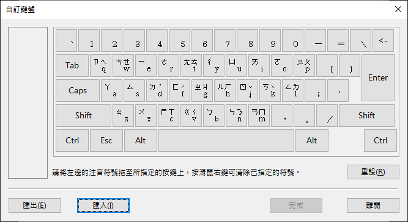
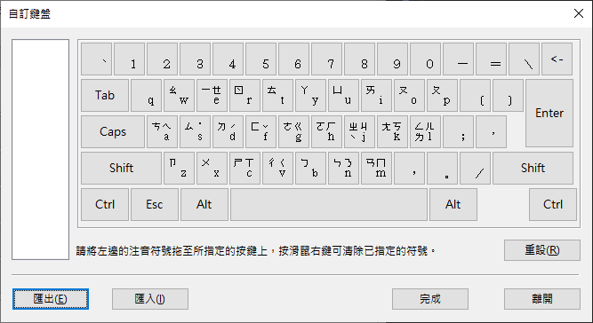

# 微軟注音輸入法-設定檔

微軟 (MicroSoft) 作業系統雖然有提供各式各樣的注音鍵盤排列方式 [標準(大千)、倚天、IBM] ， 但沒有提供大千26鍵、倚天26鍵..等排列的設定檔。

目前僅提供 <b>倚天26鍵</b> 與 <b>許氏鍵盤</b> 的設定檔。
關於追音輸入法與大千26鍵，因微軟設定的聲母、韻母及介音規則關係，無法將注音放在同一按鍵上，所以沒辦法製作出設定檔。

### 為什麼要更換注音排序方式

目前標準注音輸入法，排序的間隔太遠，如果是文字工作者或是每天都要大量使用鍵盤的中文輸入使用者，長期下來容易造成職業傷害(手腕痛？)。
縮小注音符號範圍，中文輸入可以更有效率，也可以減輕打字時所造成手指的負擔。

#### 大千標準鍵盤的缺點

   - 聲調鍵位於離手指最遠的最上排，降低了打字的效率。
   - 而相對韻母常用的ㄢㄣㄤㄥ位於最外側小指工作範圍，使右手輸入較為吃力。
   - 占用了數字鍵和部分的符號鍵，使得輸入數字和符號添加了麻煩。

### 為什麼不使用漢語拼音就好

漢語拼音要按下 5 個按鍵，注音輸入可以用 4 個按鍵搞定，就我自己評估起來，還是注音比較容易上手。

純粹個人看法，請勿筆戰 ༼ つ ◕_◕ ༽つ

# 設定方法

- 作業系統： Windows 10
- 版本：21H1
- OS 組建：19043.1237

windows 設定 → 時間與語言 → 語言 →
中文(繁體，台灣) → 選項

鍵盤 → 選項 → 一般 → 進階設定 → 開啟進階設定

微軟注音 設定 → 鍵盤

自訂(下拉選單) → 自訂鍵盤 → 

- 匯入 Windows Setup/ET26.KBD (倚天 26 鍵)  

- 匯入 Windows Setup/HSU.KBD  (許氏鍵盤)  

# 鍵盤對應表

## 大千 26 鍵
| A  | B  | C  | D  | E  | F  | G  | H  | I  | J  | K  | L  | M  | N  | O  | P  | Q  | R  | S  | T  | U  | V  | W  | X  | Y  | Z  |
|----|----|----|----|----|----|----|----|----|----|----|----|----|----|----|----|----|----|----|----|----|----|----|----|----|----|
| ㄇ | ㄖ | ㄏ | ㄎ | ㄍ | ㄑ | ㄕ | ㄘ | ㄛ | ㄨ | ㄜ | ㄠ | ㄩ | ㄙ | ㄟ | ㄣ | ㄅ | ㄐ | ㄋ | ㄓ | ㄧ | ㄒ | ㄉ | ㄌ | ㄗ | ㄈ |
|    | ㄝ |    | ˋ  | ˊ  |    |    |    | ㄞ |    |    | ㄤ | ㄡ | ㄥ | ㄢ | ㄦ | ㄆ | ˇ  |    | ㄔ | ㄚ |    | ㄊ |    | ˙  |    |
- 註：第一聲以空格鍵輸入。

## 追音輸入法
| A  | B  | C  | D  | E  | F | G  | H  | I  | J  | K  | L  | M  | N  | O  | P  | Q  | R | S  | T  | U  | V | W  | X  | Y  | Z  | Spec | ,  | .  | ;  | /  |
|----|----|----|----|----|---|----|----|----|----|----|----|----|----|----|----|----|---|----|----|----|---|----|----|----|----|------|----|----|----|----|
| ㄆ | ㄕ | ㄏ | ㄎ | ㄍ | ˊ | ㄔ | ㄈ | ㄚ | ㄨ | ㄛ | ㄣ | ㄩ | ㄋ | ㄢ | ㄥ | ㄅ | ˙ | ㄊ | ㄓ | ㄧ | ˇ | ㄉ | ㄌ | ㄞ | ㄇ | ˋ    | ㄝ | ㄤ | ㄠ | ㄡ |
|    | ㄙ | ㄒ | ㄑ | ㄐ |   | ㄘ | ˋ  |    | ˊ  | ㄜ |    | ˇ  | ㄖ |    |    |    |   |    | ㄗ | ˙  |   |    |    |    |    |      | ㄟ |    |    |    |
|    |    |    |    |    |   |    |    |    |    | ㄦ |    |    |    |    |    |    |   |    |    |    |   |    |    |    |    |      |    |    |    |    |

# 參考資料
1. [注音輸入法-維基百科](https://zh.wikipedia.org/wiki/%E6%B3%A8%E9%9F%B3%E8%BC%B8%E5%85%A5%E6%B3%95)
